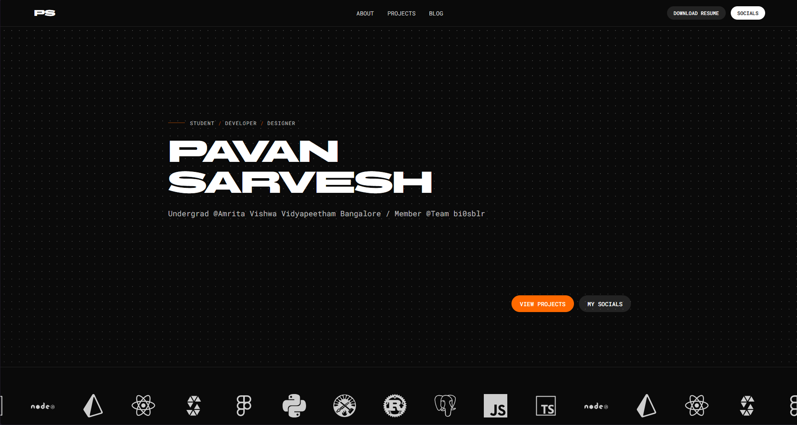

<div align="center">
  <!-- Optional: remove this line if you don't want a logo in the README -->
  

  <h1>folio2k26</h1>

  <p>Personal portfolio site built with React + TypeScript + Vite.</p>

  
</div>

## Contents

- [Overview](#overview)
- [Tech Stack](#tech-stack)
- [Project Structure](#project-structure)
- [Getting Started](#getting-started)
- [Environment Variables](#environment-variables)
- [Resume Verification](#resume-verification)
- [API Endpoints](#api-endpoints)
- [Scripts](#scripts)
- [Deployment](#deployment)
- [License](#license)

## Overview

This repo contains a React single-page application (SPA) with a small API layer used to fetch live data (e.g. WakaTime stats and Spotify recently played).

## Tech Stack

| Area            | Tech                                 | What it’s used for                             |
| --------------- | ------------------------------------ | ---------------------------------------------- |
| Frontend        | React                                | UI rendering                                   |
| Frontend        | TypeScript                           | Type-safe app code                             |
| Frontend        | React Router (`react-router-dom`)    | Client-side routing                            |
| Build / Dev     | Vite                                 | Dev server + production bundling               |
| Build / Dev     | `@vitejs/plugin-react`               | React fast refresh / JSX transform             |
| Styling         | Tailwind CSS                         | Utility-first styling                          |
| Styling         | PostCSS + Autoprefixer               | CSS processing + vendor prefixing              |
| Web3            | `viem`                               | Reading Sepolia contract state (public client) |
| Local API (dev) | Node.js + Express                    | Local `/api/*` server in development           |
| Local API (dev) | `cors`                               | CORS configuration for local API               |
| Local API (dev) | `dotenv`                             | Loads `.env` for the local server              |
| Deployment      | Vercel                               | Hosting + serverless functions                 |
| Deployment      | Vercel Node runtime (`@vercel/node`) | Serverless execution environment               |
| Tooling         | ESLint + TypeScript ESLint           | Linting (flat config)                          |
| Tooling         | pnpm                                 | Package manager                                |

## Project Structure

- `src/` — main frontend app
  - `src/pages/` — route-level pages
  - `src/components/` — reusable UI components
  - `src/data/` — static content (projects/skills/experience/etc.)
- `api/` — Vercel serverless functions (deployed API)
- `server/` — local Express server for API during development
- `public/` — static assets (includes `logo.png` and `screenshot.png`)

## Getting Started

Quick start (two terminals):

```bash
pnpm install
pnpm dev
```

In a second terminal:

```bash
pnpm exec ts-node --esm server/index.ts
```

### Prerequisites

- Node.js (recommended: current LTS)
- pnpm

### Install

```bash
pnpm install
```

### Run (frontend)

```bash
pnpm dev
```

The site starts on the Vite dev server.

### Run (API for local development)

The frontend calls `/api/*`. In development, Vite proxies `/api` to a local server on `http://localhost:3001`.

Start the API server in a second terminal:

```bash
pnpm exec ts-node --esm server/index.ts
```

If the above doesn’t work on your machine, this alternative is equivalent:

```bash
node --loader ts-node/esm server/index.ts
```

## Environment Variables

Create a `.env` file in the project root for local development (used by `server/index.ts`).

```bash
WAKATIME_API_KEY=your_wakatime_api_key

SPOTIFY_CLIENT_ID=your_spotify_client_id
SPOTIFY_CLIENT_SECRET=your_spotify_client_secret
SPOTIFY_REFRESH_TOKEN=your_spotify_refresh_token

# Frontend (Vite) env vars must start with VITE_
# Sepolia RPC used by the Resume verifier (required for the verifier to load on-chain data)
# Example public RPC:
VITE_SEPOLIA_RPC_URL=https://ethereum-sepolia-rpc.publicnode.com
# If using Ankr, you must include the API key as a path segment:
# VITE_SEPOLIA_RPC_URL=https://rpc.ankr.com/eth_sepolia/<YOUR_API_KEY>
```

For production on Vercel, add the same variables in the Vercel Project Settings.

## Resume Verification

The Resume page supports authenticity verification by comparing a locally computed SHA-256 hash
of the PDF you upload against the hash stored on-chain (Sepolia).

### User Flow

1. Open `/resume`
2. Download the Resume PDF
3. Upload that same PDF in the verifier
4. Click **Verify**

You’ll see a status badge:

- **Loading**: fetching the on-chain hash
- **Select a PDF**: no file chosen yet
- **Ready**: file selected, ready to verify
- **Verifying**: hashing the file locally
- **Verified**: local hash matches the on-chain value
- **Mismatch**: local hash does not match the on-chain value
- **Error**: failed to fetch or verify

### What’s On-Chain

- A Sepolia smart contract exposes a `resumeHash()` view method that returns a `bytes32`.
- The contract address and ABI live in `src/lib/resumeContract.ts`.
- The verifier links to Sepolia Etherscan so you can inspect the deployed contract.

### What’s Computed In The Browser

- The verifier uses the Web Crypto API (`crypto.subtle.digest`) to compute `SHA-256` over the
  raw file bytes.
- That digest is converted into a `0x...` hex string and compared (case-insensitive) to the
  on-chain `bytes32` value.

### How Sepolia + viem Works Here

- `src/lib/viem.ts` creates a `viem` public client for the `sepolia` chain using the RPC URL
  from `VITE_SEPOLIA_RPC_URL`.
- `src/lib/getResumeHash.ts` calls:
  - `client.getChainId()` and throws if it’s not Sepolia (guards against wrong RPC)
  - `client.readContract({ functionName: "resumeHash" })` to fetch the expected hash

### Troubleshooting

- **Blank / error badge immediately**: ensure `VITE_SEPOLIA_RPC_URL` is set and restart `pnpm dev`.
- **Error: RPC is on chainId X, expected Sepolia**: you pointed `VITE_SEPOLIA_RPC_URL` at the wrong network.
- **Mismatch**: make sure you uploaded the exact same PDF you downloaded (bit-for-bit).
- **401 / forbidden from RPC provider**: your RPC provider likely requires an API key (e.g., Ankr).

## API Endpoints

The app uses these endpoints:

- `GET /api/wakatime` — proxies WakaTime “last 7 days” stats
- `GET /api/spotify` — returns the most recently played Spotify track

Notes:

- On Vercel, these routes are implemented by `api/wakatime.ts` and `api/spotify.ts`.
- Locally, they are served by the Express server in `server/index.ts` and reached via the Vite proxy.

## Scripts

```bash
# Dev server
pnpm dev

# Production build
pnpm build

# Preview the production build locally
pnpm preview

# Lint
pnpm lint
```

## Deployment

- This repo is set up for SPA routing on Vercel via `vercel.json` rewrites.
- Frontend is built with Vite.
- API routes are deployed as Vercel Serverless Functions from `api/`.

## License

See `LICENSE`.
